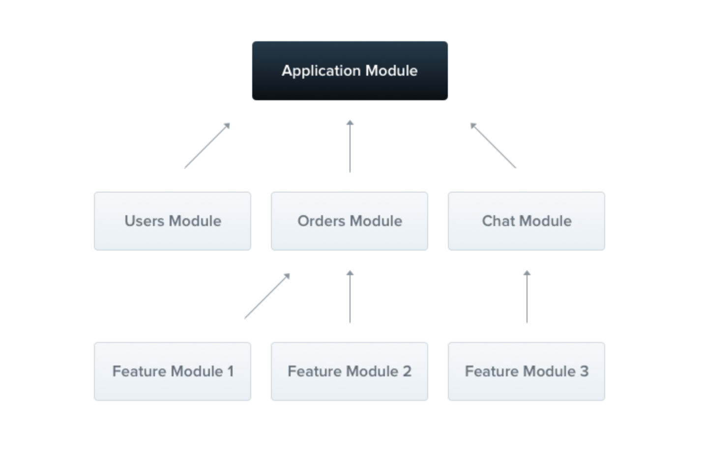

## nestjs入门

### 前提
安装node, 这里不再叙述。

### 全局安装nestjs/cli + 创建nest项目
```js
$ npm i -g @nestjs/cli
$ nest new project-name
```

##### 初始化完成代码结构如下：
```
src
 ├── app.controller.spec.ts
 ├── app.controller.ts
 ├── app.module.ts
 ├── app.service.ts
 └── main.ts
```

##### 运行`npm run start:dev`
```
<!-- 页面输出结果 -->
hell world~
```

### 控制器(Controller)
控制器负责处理传入的请求和响应

##### 设置请求路由（postman）
```js
export class CatsController {
  @Post()
  create(@Body() createCatDto: CreateCatDto) {
    return 'This action adds a new cat';
  }
  @Get()
  findAll(@Query() query: ListAllEntities) {
    return `This action returns all cats (limit: ${query.limit} items)`;
  }
  @Get(':id')
  findOne(@Param('id') id: string) {
    return `This action returns a #${id} cat`;
  }
}
```


### 提供者(Providers)
Provider 只是一个用 @Injectable() 装饰器注释的类
```js
@Injectable()
export class CatsService {
  private readonly cats: Cat[] = [];
  create(cat: Cat) {
    this.cats.push(cat);
  }
}
```

他可以做什么呢？
注入到模块里面
```js
@Module({
  controllers: [CatsController],
  providers: [CatsService],
})
export class AppModule {}
```


### 模块（Module）
模块是具有 @Module() 装饰器的类，Nest 用它来组织应用程序结构


|   |   |
|  ----  | ----  |
| providers | 由 Nest 注入器实例化的提供者，并且可以至少在整个模块中共享 |
| controllers	| 必须创建的一组控制器 |
| imports	| 导入模块的列表，这些模块导出了此模块中所需提供者 |
| exports	| 由本模块提供并应在其他模块中可用的提供者的子集。 |

